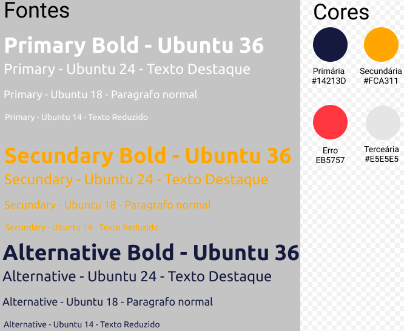
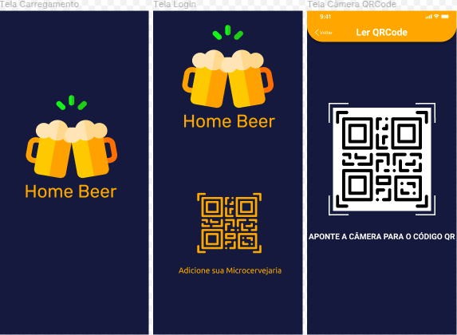
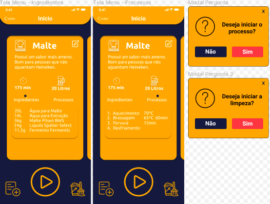
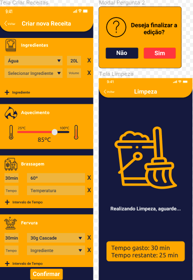
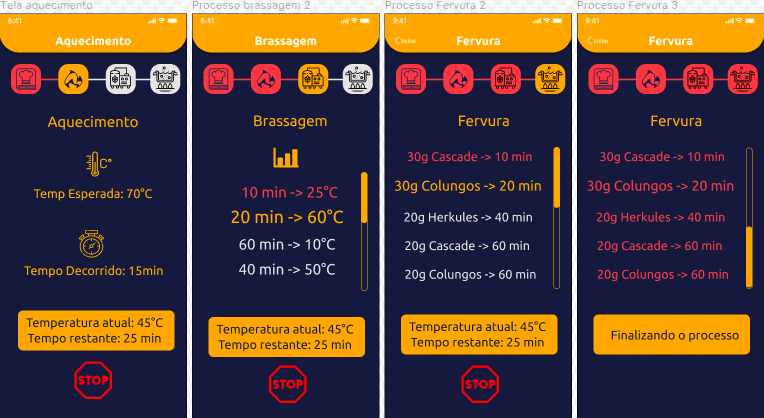
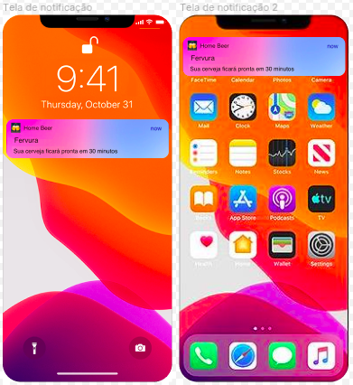

# Arquitetura da Informação
Como forma de elaborar a Arquitetura da Informação do aplicativo, foi utilizado a ferramenta Figma para elaboração de um protótipo de Alta Fidelidade e a partir dele definir o fluxo das interações, tipologia e paleta de cores do projeto.

## Identidade Visual

### Fontes
Como fonte ficou definida a utilização das fontes da família Ubuntu, por se tratarem de fontes sans-serif, ou seja facilitam a leitura para pessoas com dislexia devido a não possuirem traços e hastes rebuscadas.

### Paleta de Cores
As cores foram selecionadas de acordo com características do produto, e também buscando uma maior acessibilidade, para desenvolve-las foi utilizado a ferramenta coolors na quais os contrastes foram testados para garantir uma boa visualização para o usuário.

## Telas de Login

Os principais objetivos deste conjunto de telas é realizar o carregamento inicial da aplicação, assim como a autenticação do usuário por meio do QRCode. Ao abrir o aplicativo o usuário iria ver a tela de carregamento enquanto as fontes e outros recursos são carregados a primeira vez, logo depois apareceria a opção dele adicionar sua Microcervejaria, ao clicar no botão do QRCode sua câmera seria aberta para que o usuário apontasse para o QRCode de sua Microcervejaria, e após isso seria levado para a tela inicial da aplicação.

| Tela       | Entrada  | Interações  |  Saída | Alternativo  |
|------------|---|---|---|---|
|   Tela Carregamento  | Abrindo aplicativo  | -  | Tela Login  | - |
| Tela Login | Após carregamento  | Clicar no ícone do QRCode  |  Tela Câmera | - |
|    Tela Câmera   | Usuário liberar uso da câmera  | Apontar para o QRCode  | Tela Inicial  | Mensagem de erro na leitura do QrCode |

## Telas Iniciais

Esta e a tela de menu inicial da aplicação, nela serão informados a lista de receitas já criadas pelo usuário, e o usuário tem algumas opções como criar uma nova receita, iniciar a produção, iniciar a limpeza ou editar aquela receita.

| Tela       | Entrada  | Interações  |  Saída | Alternativo  |
|------------|---|---|---|---|
|   Tela Menu  | Leitura do QRCode  | Clicar nos ícones de editar, "play", limpeza ou criar receita, botão de voltar  | Tela de editar receita, Tela de Criar Receita, Modal de Iniciar a produção, Modal de Iniciar Limpeza  | Caso aperte no botão de voltar, volta a página de leitura do QRCode |
| Modal Pergunta - Produção | Usuário clicar no ícone de "Play"  | Botões de "Sim" ou "Não"  |  Tela Produção | Caso o usuário aperte em "Não", continua na mesma tela |
|    Modal Pergunta - Limpeza   | Usuário clicar no ícone de Limpeza  | Botões de "Sim" ou "Não"  | Tela Limpeza  | Caso o usuário aperte em "Não", continua na mesma tela |

## Telas de Criação

Estas telas são 2 dos fluxos possíveis a partir das opções da tela inicial, caso o usuário clique em criar uma nova receita os campos para serem preenchidos viram em branco e ele deve informa-los, e caso clique para editar, estes campos viram preenchidos com as informações atuais da receita que ele esta editando. Na sessão de ingredientes e na fervura o usuário vai apertar na seta onde uma lista de ingredientes já existentes vão aparecer, e também nessa lista tem uma opção de inserir um novo ingrediente para que ele digite essa opção que será guardada para futuros usos, caso ele aperte no mais. Na brassagem a seleção da temperatura sera feita por meio de um seletor na qual terão o valor máximo e mínimo que o usuário pode preencher. Nos tópicos nos quais aparecem um ícone de "Mais" significa que o usuário pode entrar com mais informações daquelas como por exemplo adicionar novos intervalos de tempo naquele processo. Já a tela de limpeza irá informar o tempo gasto com a limpeza e um tempo restante estimado para a finalização.

| Tela       | Entrada  | Interações  |  Saída | Alternativo  |
|------------|---|---|---|---|
|   Tela Criar/Editar Receitas  | Usuário clicar no ícone de criar ou editar receita na tela inicial  | Selecionar quais ingredientes e a quantidade, selecionar a temperatura de aquecimento, adicionar a rampa de temperatura da brassagem e adicionar os insumos em cada intervalo de tempo da fervura  | Modal de confirmação caso aperte confirmar  | Volta para o menu caso usuário aperte em voltar |
| Tela Limpeza | Usuário clicar no ícone de iniciar limpeza na tela inicial  | -  | Volta para o menu após conclusão | - |
|    Modal Confirmação   | Usuário apertar o botão de confirmar na tela de criar/editar receita  | Botões de "Sim" ou "Não"  | Volta para o Menu caso o usuário clique no botão de "Sim"  | Continua na tela de criar/editar receita caso o usuário clique no botão de "Não" |

## Telas do Processo

Nestas telas o objetivo princial é o usuário acompanhar o andamento atual da produção e conferir se todos os parâmetros estão corretos, caso ocorra algum problema ele irá receber notificações e também tem a opção de parar a produção. O avanço dessas telas é feito automaticamente quando um processo é finalizado o outro é iniciado e suas informações também são atualizadas de acordo com os dados que recebem dos sensores em tempo real. Caso o usuário queira ver alguma informação do processo que já passou ele pode clicar neste processo para que abra uma modal com estas informações a respeito dele.

| Tela       | Entrada  | Interações  |  Saída | Alternativo  |
|------------|---|---|---|---|
|   Tela Aquecimento  | Após o usuário confirmar o inicio da produção  | Parar produção, clicar na receita para verificar a receita  | Após finalizado, vai para a tela de brassagem  | Para a produção e o usuário volta para a tela inicial |
| Tela Brassagem | Após o término da fase de aquecimento  | Parar produção, clicar nos processos anteriores para verificar o que ocorreu durante eles  |  Após finalizado, vai para a tela de fervura | Para a produção e o usuário volta para a tela inicial |
|    Tela Fervura   | Após o término da fase de brassagem  | Parar produção, clicar nos processos anteriores para verificar o que ocorreu durante eles  | Após finalizado o usuário pode retirar sua cerveja e volta para o menu inicial  | Para a produção e o usuário volta para a tela inicial |

## Exemplos de Notificação

Durante a produção o usuário irá receber notificações a respeito do andamento da produção, como em casos de erros, casos que necessitem sua atenção direta e também para avisar a respeito do andamento do processo. As notificações que serão implementadas são as seguintes:

- Inicio da Produção;
- Inicio da Brassagem;
- Inicio da Fervura;
- 30 minutos para o término da produção;
- 15 minutos para o término da produção;
- Sua cerveja esta pronta;
- Erro na produção;
- Limpeza finalizada;

| Tela       | Entrada  | Interações  |  Saída | Alternativo  |
|------------|---|---|---|---|
|   Notificação  | Inicio da produção, mudança de etapas da produção, contagem para final da produção, término da produção e término da limpeza  | Ao clicar na notificação o usuário será direcionado para a tela que aquela notificação se refere  | Tela que se refere aquela notificação  | - |
