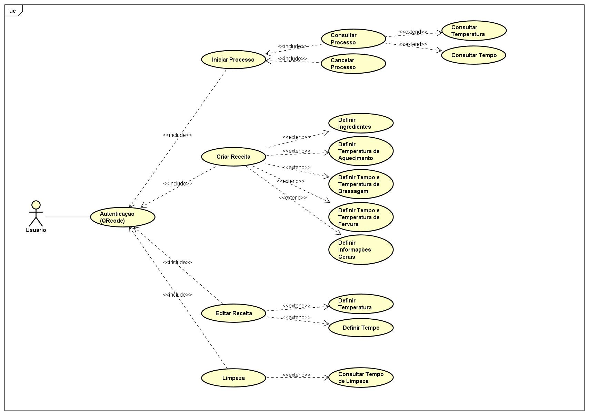

# Diagrama de Casos de Uso
&nbsp;
O diagrama de caso de uso é uma ferramenta visual que define ou caracteriza o comportamento do sistema como um todo. Com esse diagrama, é possível visualizar as interações entre o usuário e o sistema, no qual, são descritos por um caminho de ações juntamente com um conjunto de alternativas. Com isso, a atenção principal do desenvolvimento desse diagrama foi derecionado para visualizar, especificar e documentar o comportamento de um elemento.

