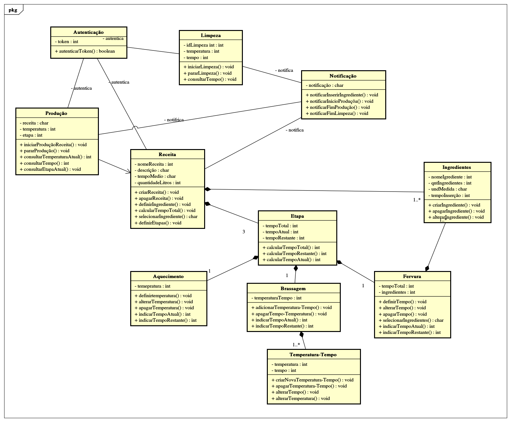

# Diagrama de Classe
O diagrama de classe trás informações relevantes sobre o projeto como: classes, atributos e funções além das associações entre as classes presentes. Por este motivo se torna um dos diagramas UML mais utilizados, pois com o mesmo é possível ter uma visão mais geral do projeto.

