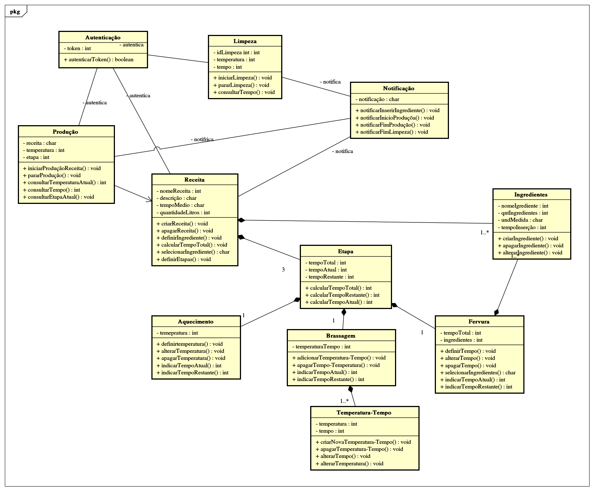
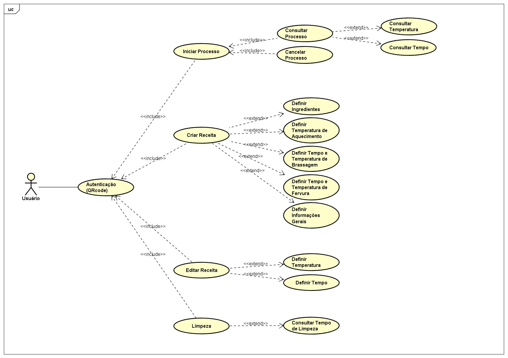
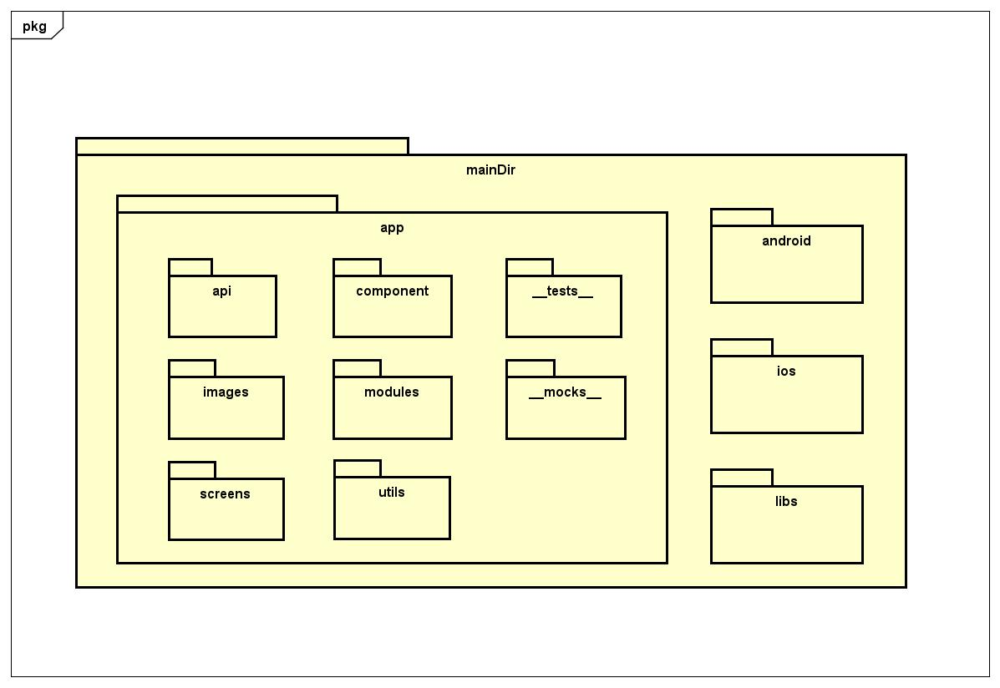
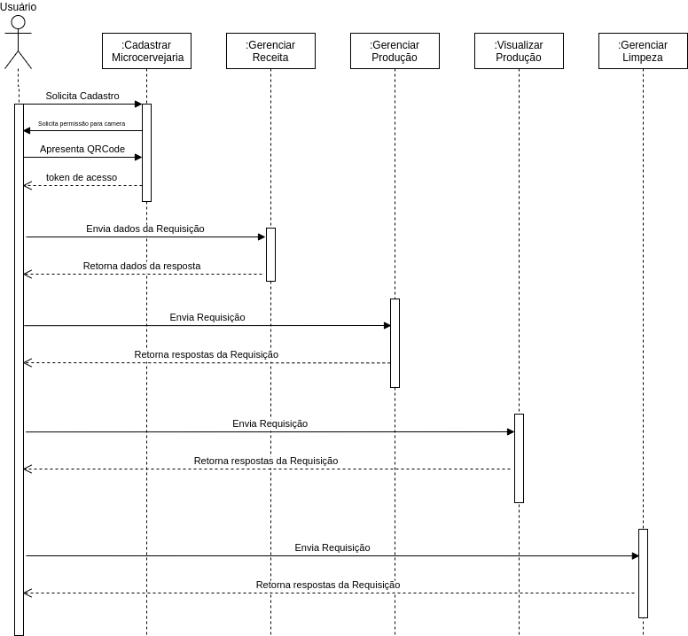

# Diagrama de Classe
O diagrama de classe trás informações relevantes sobre o projeto como: classes, atributos e funções além das associações entre as classes presentes. Por este motivo se torna um dos diagramas UML mais utilizados, pois com o mesmo é possível ter uma visão mais geral do projeto.

# Diagrama de Casos de Uso
&nbsp;
O diagrama de caso de uso é uma ferramenta visual que define ou caracteriza o comportamento do sistema como um todo. Com esse diagrama, é possível visualizar as interações entre o usuário e o sistema, no qual, são descritos por um caminho de ações juntamente com um conjunto de alternativas. Com isso, a atenção principal do desenvolvimento desse diagrama foi direcionado para visualizar, especificar e documentar o comportamento de um elemento.

# Diagrama Inicial de Estrutura dos Pacotes
&nbsp;

# Diagrama de Sequência
&nbsp;
O diagrama de sequência tem como objetivo apresentar o fluxo sequencial da interação dos objetos da solução de software. Este diagrama registra o comportamento de um único caso de uso e apresenta todas as mensagens passadas entre este e outros objetos que interajam com ele, assim como ordena em uma linha do tempo como seria sua execução.

