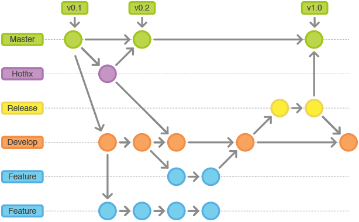

# Plano de Gerenciamento e Configuração de Software

## 1. Introdução
Este documento tem como propósito descrever os padrões de desenvolvimento e ferramentas que serão adotadas no decorrer do desenvolvimento e manutenção do software, assim como as políticas para tanto.

## 2. Ferramentas
| Ferramenta | Descrição |
| --- | --- |
| [Git](https://git-scm.com/) | Ferramenta utilizada para o controle e versionamento do código. |
| [GitHub](https://github.com/) | Plataforma onde será hospedado o repositório do código da aplicação. |
| [Travis CI](https://travis-ci.org/) | Serviço de integração contínua hospedado, usado para criar e testar projetos de software hospedados no GitHub e Bitbucket. |
| [ESLint](https://eslint.org/) | Ferramenta para analisar estaticamente o código para encontrar problemas rapidamente. |
| [Code Climate](https://codeclimate.com/) | Ferramenta para analisar estaticamente a qualidade do código. |

## 3. Políticas de Contribuição
### 3.1. Folha de Estilo
O padrão adotado no código deverá seguir a folha de estilo do [Airbnb](https://airbnb.io/javascript/react/).

### 3.2. Política de Commits
Os commits deverão ser atômicos. Para isso, ele deverá conter uma única alteração, seguindo o padrão de folha de estilo, e com uma descrição significativa em português. Utilizando os verbos no Indicativo para expressar a ação que foi feita. Ex: **Adiciona tela de inicio**.

### 3.3. Política de Branches
As branches serão criadas com base no modelo estabelecido pelo [Gitflow](https://medium.com/trainingcenter/utilizando-o-fluxo-git-flow-e63d5e0d5e04).
A **master** é a branch principal do projeto. Ela conterá todas as funcionalidades estáveis e homologadas.
A **develop** é a branch de desenvolvimento. Todas as branches (**bug**, **hotfix**, **user story** ou **task**) deverão ser criadas a partir dela e quando finalizadas, mescladas (merged) nela a partir do Pull Request.
A **release** é a branch que será usada para homologar novas funcionalidades. Após aprovação, será mesclada na master. Ex.: release/0.1.0
A **hotfix** é a branch que será usada quando tiver um erro crítico na **master**, branch de produção. Ex.: hotfix/bug-alteracao-senha
As branches para as **features** deverão ser criadas a partir da **develop** e deverão ser nomeadas com a numeração e nome da História de Usuário a ser desenvolvida. Ex.: feature/us10-perfil-usuario

### 3.4. Política de Versionamento
Os Pull Requests (PR) poderão ser abertos durante o desenvolvimento da feature, como draft (rascunho) para ser acompanhado, ou após a finalização da implementação.
Para o PR ser considerado completo para ser revisado, ele deverá seguir alguns requisitos:
* Seguir o template para PRs;
* padrão de branches;
* padrão de commits;
* ter todas as tarefas da História de Usuário realizadas;
* Ter a build no Continuous Integration (CI) construída com sucesso.

## 4. Pipeline
O pipeline de integração contínua deve possuir os passos de verificação de estilo de código, build e testes. Essas etapas devem ser gerenciadas por uma ferramenta de Continuous integration (CI). O CI deve ser executado toda vez que um PR for aberto e deve ser um critério bloqueio de merge. Enquanto o PR estiver aberto, todo push na branch executará uma verificação no CI.

