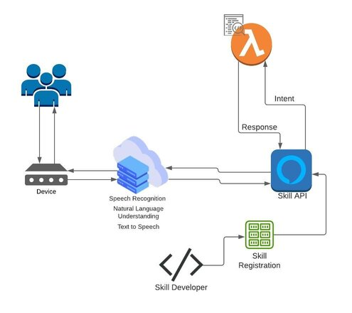

# **Proposta de Inovação Alexa**  #
&nbsp;

## Objetivo Geral ##
Como proposta de Inovação, foi definido pela equipe o uso do Alexa como serviço de voz. Como quase todos os integrantes
possuem baixa experiencia com a tecnologia, foi iniciado um estudo e a criação deste documento por parte dos integrantes
de Engenharia de Software, para que, no decorrer do projeto, cada integrante seja capaz de implementar e integrar a solução proposta.

&nbsp;

## Descrição do Problema e Proposta de Inovação ##

Como primeira definição, o aplicativo será criado para facilitar o controle de processos da microcervejaria com
uma interface gráfica intuitiva e simples para o uso diário. Também foi decidico que o sistema será desenvolvido
em uma tecnologia híbrida utilizando a linguagem React Native, consumindo uma API para comunicação. Como a solução
de software em si se baseia em controle do processo, a conversação/comandos de voz se integram de maneira eficiente
e simples com as funcionalidades do sistema. Com base nisso, não é difícil inferir que com o uso da Alexa pode proporcionar
experiências de voz naturais que oferecem aos clientes uma maneira mais intuitiva de interagir com a tecnologia. Ainda
sobre a Alexa, é possível personalizar e enriquecer a tecnologia com varias "skills", melhorando a experiência e tornando-o
muito útil para as necessidades cotidianas.

&nbsp;

 ### **Como irá funcionar?** ###

Alexa funciona com base no processamento de linguagem natural(NLP), que representa um procedimento de conversão de
fala em palavras, sons e ideias.

1. Passo: O usuário manda sua pergunta ou solicitação para quaisquer dispositivo que trabalhe com a tecnologia da Alexa.
Para analisar uma solicitação, um comando precisa possuir 3 partes principais

    * Wake word: Quando os usuários dizem 'Alexa', o que desperta o dispositivo. A palavra de ativação colocou a Alexa no modo de escuta e pronta para receber instruções do usuário.
    * Invocation name: é a palavra-chave usada para acionar uma “skill” específica. Os usuários podem combinar o nome da invocação com uma ação, comando ou pergunta. Todas as skills personalizadas devem ter um nome de invocação para iniciá-las.
    * Utterance: são frases que os usuários usarão ao fazer uma solicitação para Alexa. Alexa identifica a intenção do usuário a partir da expressão dada e responde de acordo. Então, basicamente, o enunciado decide o que o usuário deseja que Alexa execute.

2. Passo: A Amazon divide a requisição em sons individuais. Em seguida, ele consulta o banco de dados contendo
pronúncias de várias palavras, para que seja possível descobrir quais palavras correspondem com a combinação de
sons individuais.

3. Passo: Identifica palavras importantes ou palavras chave para dar sentido às tarefas e realizar as funções

4. Passo: Nessa etapa, cada intent pode ser identificada por uma ou mais palavras ou frases, cada uma das quais é chamada de enunciado. Depois da identificação da intent, a função lambda ira retornar a resposta de acordo com a intent requisitada.

5. Passo: Os servidores da Amazon enviam as informações de volta ao seu dispositivo, que em seguida,
trará o resultado da requisição. Se o dispositivo precisar responder alguma requisição específica, ela passará
pelo mesmos passos anteriores, porém, na ordem inversa.

&nbsp;

### **Como está sendo implementado?** ###

&nbsp;

&nbsp;

Depois de compreender que as skills da Alexa são aplicativos ativados por voz que adicionam recursos ao dispositivo compatível com a Alexa, para iniciar a construção de uma skill personalizada, é necessário a implementação da função AWS Lambda ou de um serviço da web. Desse modo, compreende-se que é possível também usar as funções de Lambda para criar serviços que oferecem novas habilidades para o Alexa. O Alexa Skills Kit fornece as APIs, as ferramentas e a documentação para criar essas novas habilidades, com base em seus próprios serviços em execução como funções de Lambda. Os usuários podem acessar essas novas habilidades fazendo perguntas ao Alexa ou fazendo solicitações.

### Referências ###

* https://chatbotsmagazine.com/how-does-alexa-skills-works-82a7e93dea04
* https://developer.amazon.com/en-US/docs/alexa/ask-overviews/build-skills-with-the-alexa-skills-kit.html
