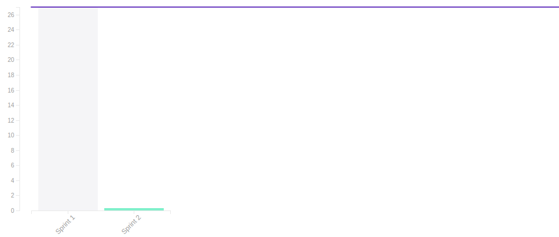

# Resultado da Sprint 1

# 1. Revisão

| História | Foi concluída? |
| -------- | :----: |
| DOC01 - Documento de Visão | :white_check_mark: |
| DOC02 - Criar termo de abertura do Projeto(TAP) | :white_check_mark: |
| DOC03 - Criar Backlog | :white_check_mark: |
| DOC04 - Criar EAP | :white_check_mark: |
| DOC05 - Documento de Arquitetura | :white_check_mark: |
| DOC06 - Plano de Gerenciamento de Riscos | :white_check_mark: |
| AMB01 - Configurar Github Pages | :white_check_mark: |

## 1.1 O que foi feito?
 * DOC01 - Documento de Visão
 * DOC02 - Criar termo de abertura do Projeto(TAP)
 * DOC03 - Criar Backlog
 * DOC04 - Criar EAP
 * DOC05 - Documento de Arquitetura
 * DOC06 - Plano de Gerenciamento de Riscos
 * AMB01 - Configurar Github Pages

## 1.2. O não foi feito e por que não foi feito?

  *  Não se aplica.

# 2. Retrospectiva

## 2.1. O que deu certo?  

* Divisão das Tarefas;
* Entrega das Tarefas;

## 2.2. O que deu errado?

* Divisão do protótipo com todos do grupo
* Documento em vários formatos(doc, md e latex. Acabaram gerando retrabalho)
* Falta de alinhamento com outras frentes do projeto

## 2.3. Como melhorar?
### 2.3.1. Must Have
* Evitar atividades com todos;
* Considerar no planejamento a escrita do Documento em Latex;
* Reunião de alinhamento com outros diretores antes da reunião de software;

### 2.3.2. Nice To Have
* Adiantar mais atividades

# 3. Velocity

# 4. Relato do Scrum Master

Esta por ser a primeira Sprint não tinhamos um conhecimento da produtividade da equipe para tomar como base para o planejamento
a divisão funcionou de forma que todos os membros conseguiram entregar suas atividades  não se sentirem sobrecarregados, porém mostrou que a equipe
tem condições de entregar ainda mais atividades logo na próxima isto pode ser levado em consideração. O time ainda esta se adaptando a melhor
forma de conduzir as reuniões e como seguir a metodologia, e para aumentar o rendimento dos membros alguns rituais do Scrum vem sendo realizados
não da maneira recomendada e sim de um modo que consigamos finalizar mais rapido e dar uma enfase maior na produção e naqueles rituais que necessitem
mais o grupo completo presente. No geral foi uma boa primeira semana para conhecer melhor a dedicação dos membros
